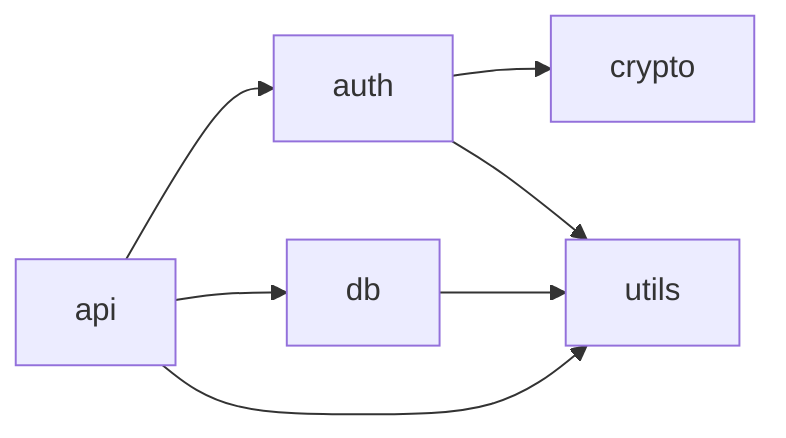
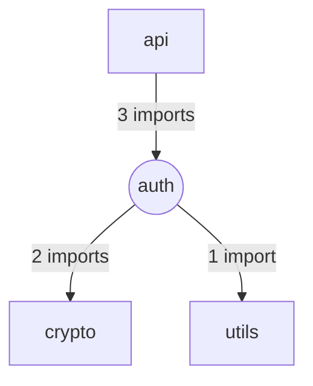

# Skill: Visualize Architecture

## Overview

Generate visual representations of code architecture from `.topology/` artifacts using available projectors.

## When to Use

- When asked to "show the architecture" or "visualize dependencies"
- When explaining code structure to stakeholders
- When identifying tightly coupled clusters visually
- When creating documentation diagrams

## Prerequisites

- `.topology/` directory must exist with valid artifacts
- For 3D visualization: `graphs/coupling-matrix.json` with layout positions

## Inputs

| Input | Required | Description |
|-------|----------|-------------|
| `topology_path` | No | Path to `.topology/` directory (default: `./.topology`) |
| `projector` | No | Visualization type: `3d-force`, `graphviz`, `mermaid` |
| `format` | No | Output format: `html`, `svg`, `png`, `mermaid`, `dot` |
| `output` | No | Output file path |
| `focus` | No | Focus on specific module or function |

## Available Projectors

### `3d-force` — 3D Force-Directed Coupling Visualization

Best for: Understanding coupling clusters, architectural zones

```
Output: Interactive HTML with Three.js
- Tightly coupled modules cluster together
- Node size = complexity
- Node color = instability (red=unstable, blue=stable)
- Edge thickness = coupling strength
```

### `graphviz` — DOT/SVG Graph Diagrams

Best for: Formal documentation, static diagrams

```
Output: SVG, PNG, or DOT source
- Hierarchical or force-directed layout
- Clean edges with labels
- Suitable for print/documentation
```

### `mermaid` — Markdown-Embeddable Diagrams

Best for: README files, GitHub issues, documentation

```
Output: Mermaid diagram syntax
- Copy-paste into markdown
- Renders in GitHub, GitLab, Notion
- Simple and readable
```

## Example Usage

### Generate 3D Visualization

```
User: Show me the architecture of this codebase in 3D.

Agent: I'll generate a 3D coupling visualization.

[Runs projector]

Generated: architecture.html

Open in browser to explore:
- Drag to rotate, scroll to zoom
- Clustered modules are tightly coupled
- The auth-crypto cluster is visible (coupling: 0.75)
- utils is floating separately (low coupling)
```

### Generate Mermaid Diagram

```
User: Create a dependency diagram I can put in the README.

Agent: Here's a Mermaid diagram of the module dependencies:



The api module is the entry point with dependencies on auth, db, and utils.
```

### Focus on Specific Module

```
User: Show me what auth connects to.

Agent: Here's the auth module's connections:



Auth is called by api and depends on crypto and utils.
```

## Output Interpretation

### 3D Visualization

| Visual | Meaning |
|--------|---------|
| Clustered nodes | Tightly coupled modules |
| Isolated nodes | Loosely coupled / independent |
| Large nodes | High complexity |
| Red nodes | High instability (I≈1) |
| Blue nodes | Low instability (I≈0) |
| Thick edges | Strong coupling |

### Martin's Zones (visible in 3D)

| Zone | Characteristics | Visual Pattern |
|------|-----------------|----------------|
| Main Sequence | Balanced A+I≈1 | Healthy, varied colors |
| Zone of Pain | Concrete+Stable | Blue, many incoming edges |
| Zone of Uselessness | Abstract+Unstable | Red, few edges |

## Error Handling

| Error | Action |
|-------|--------|
| No coupling matrix | Fall back to dependency graph |
| No layout positions | Run force simulation, save positions |
| Projector not available | Suggest alternative projector |

## Related Skills

- `analyze-topology` — Generate topology artifacts first
- `query-coupling` — Get detailed coupling metrics

