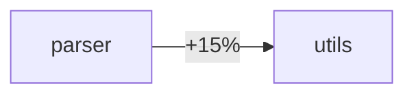

# CI01: GitHub Actions CI Integration

**Profile**: `CI` (Continuous Integration)  
**Parent**: EXP-V1-0001 Code Topology  
**Status**: Experimental

## Purpose

Provides GitHub Actions workflows and tooling to enforce architectural quality gates in pull requests. The CI integration:

1. **Analyzes** the PR branch using the Rust adapter (or other language adapters)
2. **Compares** topology metrics against the base branch
3. **Blocks** PRs that exceed configured thresholds
4. **Comments** with actionable feedback and visualizations

## Architecture

```
┌─────────────────────────────────────────────────────────────────┐
│                      CI TOPOLOGY CHECK                          │
├─────────────────────────────────────────────────────────────────┤
│                                                                 │
│   PR Opened  ──▶  Analyze PR Branch  ──▶  Analyze Base Branch  │
│                          │                        │             │
│                          ▼                        ▼             │
│                   .topology-pr/            .topology-base/      │
│                          │                        │             │
│                          └────────────┬───────────┘             │
│                                       ▼                         │
│                              Diff Analyzer                      │
│                                       │                         │
│                    ┌──────────────────┼──────────────────┐      │
│                    ▼                  ▼                  ▼      │
│              New Hotspots      Coupling Δ        Zone Changes   │
│                    │                  │                  │      │
│                    └──────────────────┼──────────────────┘      │
│                                       ▼                         │
│                         Check Against Thresholds                │
│                                       │                         │
│                    ┌──────────────────┼──────────────────┐      │
│                    ▼                  ▼                  ▼      │
│               ✅ Pass           ⚠️ Warning          ❌ Fail      │
│                    │                  │                  │      │
│                    └──────────────────┼──────────────────┘      │
│                                       ▼                         │
│                            Post PR Comment                      │
│                                                                 │
└─────────────────────────────────────────────────────────────────┘
```

## Components

| File | Purpose |
|------|---------|
| `templates/topology-check.yml` | GitHub Actions workflow template |
| `docs/01_spec.md` | Configuration and threshold specification |
| `docs/02_adoption.md` | How to adopt in your project |
| `examples/` | Sample configurations |

## Quick Start

1. Copy the workflow template to your project:
   ```bash
   cp templates/topology-check.yml .github/workflows/
   ```

2. Create a threshold configuration:
   ```bash
   mkdir -p .topology
   cp examples/config.toml .topology/config.toml
   ```

3. Customize thresholds in `.topology/config.toml`

4. Open a PR and watch the magic happen!

## Thresholds

Default thresholds (configurable):

| Metric | Warning | Failure |
|--------|---------|---------|
| Function CC | > 10 | > 20 |
| Function Cognitive | > 15 | > 30 |
| Module Coupling Δ | > 10% | > 25% |
| Distance from Main Sequence | > 0.5 | > 0.8 |

## Example PR Comment

```markdown
## 🔍 Topology Analysis — ⚠️ 2 warnings

### Summary
| Metric | Base | PR | Δ |
|--------|------|----|---|
| Total CC | 234 | 248 | +14 🔺 |
| Max CC | 12 | 18 | +6 ⚠️ |

### New Hotspots
⚠️ `parser::parse_complex` — CC: 18 (threshold: 15)

### Module Changes

```

